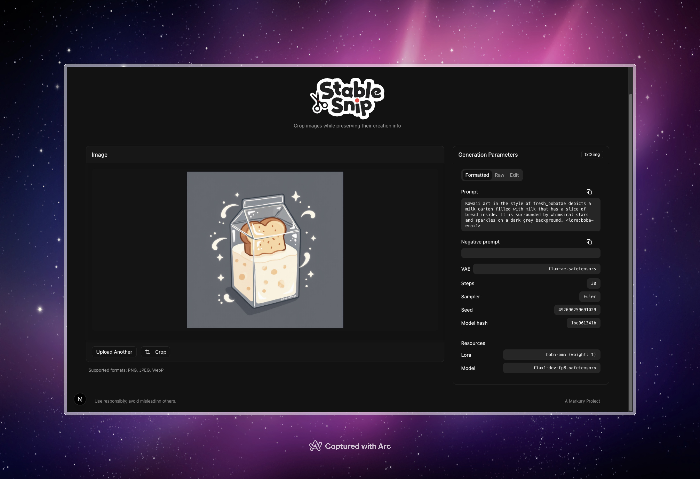

<p align="center">
    
<p>

# StableSnip

A tool for cropping AI-generated images while preserving their metadata.



## Features

- Crop images while maintaining AI generation metadata
- View and edit embedded metadata (prompts, negative prompts, sampling parameters)
- Support for Stable Diffusion and ComfyUI metadata formats
- Interactive cropping with rotation, flipping, and aspect ratio controls

## Development

```bash
# Install dependencies
bun install

# Run development server
bun run dev

# Build for production
bun run build

# Start production server
bun run start

# Lint code
bun run lint
```

## Technologies

- Next.js
- React
- TailwindCSS
- ExifReader
- PNG chunk manipulation